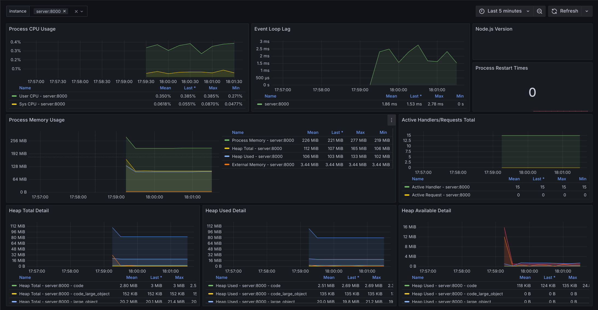

# Scalable Nest.js Boilerplate


## Features📦

- [x] NestJS with Fastify
- [x] Postgres
- [x] TypeORM
- [x] Offset and Cursor based Pagination
- [x] REST & GraphQL API
- [x] Swagger Documentation and API versioning for REST API
- [x] Automatic API generation on the frontend using OpenAPI Codegen [Learn More](#1-automatic-api-generation-on-the-frontend)
- [x] Websockets
- [x] BullMQ for Queues. Bull board UI to inspect your jobs.
- [x] Worker server for processing background tasks like queues.
- [x] Caching using Redis
- [x] Pino for Logging
- [x] Rate Limiter using Redis
- [x] Graceful Shutdown
- [x] Server & Database monitoring with Prometheus & Grafana [Learn More](#4-server-monitoring)
- [x] File Uploads using AWS S3
- [x] Sentry
- [x] Testing with Jest
- [x] Internationalization using i18n
- [x] pnpm
- [x] Docker: Dev & Prod ready from single script. [Learn More](#5-docker)
- [x] Github Actions
- [x] Commitlint & Husky
- [x] SWC instead of Webpack
- [x] Dependency Graph Visualizer [Learn More](#2-dependency-graph-)
- [x] Database Entity Relationship Diagram Generator [Learn More](#3-database-entity-relationship-diagram️)

### 1. Automatic API generation on the Frontend🚀

You can automatically generate and use all of your backend API in frontend in just one command, thanks to Swagger and OpenAPI spec. 

### 2. Dependency Graph 📈

Visualize all of your project modules and their dependencies. Also, detect circular dependencies.

NOTE: Make sure [Graphviz](https://www.graphviz.org/) is installed first.

- All dependencies:

```
pnpm graph:app
```

- Only circular dependencies:

```
pnpm graph:circular
```

<figure>

<figcaption style="text-align: center; font-style: italic;">Sample Graph</figcaption>
</figure>

### 3. Database Entity Relationship Diagram🛢️

Visualize your database entities and their relationships.

```
pnpm erd:generate
```

<figure>

<figcaption style="text-align: center; font-style: italic;">Sample ERD</figcaption>
</figure>

### 4. Server Monitoring

Prometheus & Grafana are available with Docker setup. They're available when application is ready after running `pnpm docker:<dev | prod>:up`.

Make sure to set Grafana username and password in `.env` file to access the server dashboards.



### 5. Docker 🐬

##### For local development:

- Start container:

```
pnpm docker:dev:up
```

- Stop container:

```
pnpm docker:dev:down
```

##### For prod build:

- Start container:

```
pnpm docker:prod:up
```

- Stop container:

```
pnpm docker:prod:down
```

##### Deployment:

```
sh ./bin/deploy.sh
```

or run workflow `.github/workflows/main.yml` via GitHub Actions.


### Cred
Made by [4SRG](https://github.com/zannunakiz)